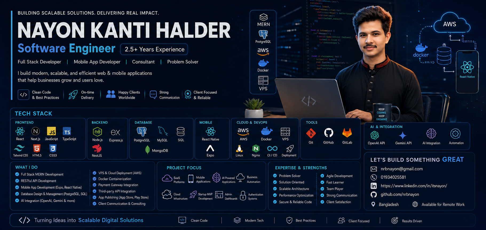

  

<!-- Title & Typing SVG -->
<h3 align="center">
  <samp>
    &gt; Hey There! I'm
    <b><a target="_blank" href="https://www.linkedin.com/in/itsnayon/">Nayon Kanti Halder</a></b> 👋
  </samp>
</h3>

  <samp>
    「 Software Engineer | Building Scalable Web & Mobile Applications 」  
  </samp>

  

  

  
  
  
  

  

### 💫 About Me

> **"Building scalable solutions. Delivering real impact."**

I am a passionate **Software Engineer** with **2.5+ years of hands-on experience** crafting modern, high-performance, and scalable web & mobile applications.

- 💼 **Current Role**: Executive Software Engineer
- 🎯 **Core Expertise**: Full Stack Web Development (MERN, NestJS) & Mobile Apps (React Native, Expo)
- 🤖 **AI & Automation**: Integrating OpenAI API & Gemini API into business workflows
- 🌐 **Cloud & Infrastructure**: AWS, VPS Deployment, Docker Containerization, Nginx, CI/CD
- 🏆 **Core Engineering Philosophy**: Clean Code & Best Practices | On-Time Delivery | Scalable Architecture | Client-Focused

 

  

### 🏆 Honors & Awards

<table width="100%">
  <tr>
    <td width="40%" align="center" valign="middle">
      
    </td>
    <td width="60%" valign="middle">
      <h3>🌟 Best Employee of the Q4 (2025 - 2026)</h3>
      
<b>Organization:</b> Join Venture AI

      
<b>Role:</b> Front-End / Software Developer

      
<i>Recognized for outstanding performance, technical leadership, commitment to excellence, and high-impact contributions to core engineering projects.</i>

       
      
    </td>
  </tr>
</table>

 

  

# 🛠 Technologies & Core Stack

<table border="0" cellspacing="10" cellpadding="0" width="100%">
<tr>

<!-- LEFT: DEV ICONS MATRIX -->
<td width="50%" valign="top" align="center">

<h3>💻 Core Tech Stack</h3>
 

<table align="center" cellspacing="0" cellpadding="8">
  <tr>
    <td align="center"></td>
    <td align="center"></td>
    <td align="center"></td>
    <td align="center"></td>
    <td align="center"></td>
  </tr>
  <tr>
    <td align="center"></td>
    <td align="center"></td>
    <td align="center"></td>
    <td align="center"></td>
    <td align="center"></td>
  </tr>
  <tr>
    <td align="center"></td>
    <td align="center"></td>
    <td align="center"></td>
    <td align="center"></td>
    <td align="center"></td>
  </tr>
  <tr>
    <td align="center"></td>
    <td align="center"></td>
    <td align="center"></td>
    <td align="center"></td>
    <td align="center"></td>
  </tr>
</table>

</td>

<!-- RIGHT: CATEGORIZED TABLE -->
<td width="50%" valign="top">

<h3>📋 Categorized Skills</h3>

- **Frontend**: React, Next.js, JavaScript, TypeScript, Tailwind CSS, HTML5, CSS3
- **Backend**: Node.js, Express.js, NestJS, REST APIs, WebSockets
- **Databases**: PostgreSQL, MySQL, MongoDB, Redis
- **Mobile**: React Native, Expo
- **Cloud & DevOps**: AWS, Docker, Linux, Nginx, CI/CD
- **AI & Automation**: OpenAI API, Gemini API, Business Automation
- **Tools**: Git, GitHub, GitLab, Postman, VS Code, Swagger

</td>

</tr>
</table>

 

  

### 🛠️ What I Do & Project Focus

<table width="100%">
  <tr>
    <td width="50%" valign="top">
      <h4>⚡ What I Do</h4>
      <ul>
        <li><b>Full Stack MERN & NestJS Development</b></li>
        <li><b>Mobile App Development</b> (Expo & React Native)</li>
        <li><b>RESTful API Design & Microservices</b></li>
        <li><b>Database Architecture</b> (PostgreSQL, MongoDB, MySQL)</li>
        <li><b>AI Integration</b> (OpenAI API, Gemini API & LLMs)</li>
        <li><b>Cloud & VPS Deployment</b> (AWS, Nginx, Docker)</li>
        <li><b>Payment Gateway & Third-Party Integration</b></li>
        <li><b>App Publishing</b> (App Store & Google Play Store)</li>
      </ul>
    </td>
    <td width="50%" valign="top">
      <h4>🎯 Project Focus</h4>
      <ul>
        <li><b>SaaS Platforms</b> & Web Applications</li>
        <li><b>Mobile Applications</b> (iOS & Android)</li>
        <li><b>AI-Powered Applications</b> & Smart Automation</li>
        <li><b>Startup MVP Development</b> (0 to 1 product creation)</li>
        <li><b>Admin Dashboards</b> & Analytics Interfaces</li>
        <li><b>Authentication & Authorization Systems</b></li>
        <li><b>Cloud Infrastructure</b> & CI/CD Pipelines</li>
      </ul>
    </td>
  </tr>
</table>

 

  

### 📊 Vital Statistics & GitHub Analytics

#### 📈 Interactive 3D Contribution Graph

  

 

#### 🔥 GitHub Streak Stats

  

 

  

<table width="100%" border="0" cellspacing="10" cellpadding="0">
<tr>

<!-- LEFT: COLLABORATION -->
<td width="48%" valign="top">

<h3>🤝 Collaboration</h3>

I’m open to collaborating on:

<ul>
  <li>Full Stack Web & SaaS Applications</li>
  <li>Mobile App Development (React Native / Expo)</li>
  <li>Backend Architecture & Microservices</li>
  <li>AI Integration & Automation Projects</li>
</ul>

</td>

<!-- RIGHT: CONTACT -->
<td width="48%" valign="top" align="center">

<h3>📫 Connect & Contact</h3>

  

  

  

</td>

</tr>
</table>

 

  
  
  

  

  <b>Turning Ideas into Scalable Digital Solutions</b> • Clean Code • Modern Tech • Best Practices • Client Focused

